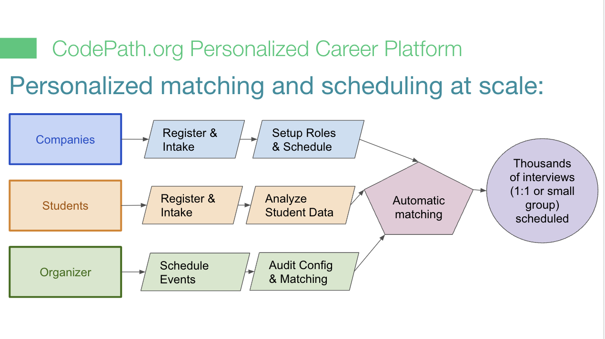

# Learning Platform

## Overview

At CodePath, we have created the building blocks of a powerful learning and knowledge platform. This platform provides a significantly better way for developers to document their technical knowledge, collaborate on curriculum, and schedule and execute effective courses.

This isn't a single tool or software but instead a suite of software solutions specifically targeting technical documentation and training.

### Principles

This learning platform has a number of guiding principles:

* No online platform can ever replace the importance of social and in-person interactions
* Designing and building courses should be similar to building open-source software
* Courses must be measured and improved based on continuous feedback and analytics
* Leverage software and frameworks to ensure course quality from design to execution

We want to build the premier learning platform for highly effective, scalable, and outcome-oriented technical education. Our goal is for this platform to be capable of supporting by hundreds or even thousands of in-person high-touch courses at the same time.

### Platform

The learning platform consists of a variety of functions and features targeted around the following:

* **Curriculum Development -** Curriculum collaboration for technical content with easy branching and tracking
* **Course Scheduling -** Scheduling solution for courses offered where applicants can apply to a course
* **Admissions Management** - Admissions system for accepting applicants and managing the end-to-end admission process
* **Hybrid Course Delivery System -** Online course platform for seamless hybrid courses combining live and online components.
* **Assignment Tracking and Scoring** - Tracking assignment submissions from participants during the course with built-in scoring.&#x20;
* **Course Workflow Automation** - Built for scale with strategic automation, including automated absence tracking, smart team formation, and much more.&#x20;
* **Technical Q\&A Support System -** Searchable question and answer system for technical issues during the course
* **Technical Guides -** Documentation of technical topics which is well-structured and searchable
* **Announcements and Reminders** - Online integrated communication and messaging platform during the course&#x20;
* **Analytics Platform** - Collection and visualizations of all classroom, instructor, and participant analytics

Review the [Learning Platform Slides](https://docs.google.com/presentation/d/1i5NB29bR9rRNh7tKIVQJMX9kzMps1TmsghueZOryMgo/edit) for a high-level overview.

## Components

This learning platform consists of the following major software components:

| Component   | Description                                                       |
| ----------- | ----------------------------------------------------------------- |
| Scheduler   | Course scheduler for booking and viewing upcoming classes         |
| Enrollment  | Allow eligible applicants to apply to upcoming courses            |
| Admissions  | Manages the admission process for any course start to finish      |
| Courses     | Course content viewer available for access by participants        |
| Discussions | Questions and answer companion for solving technical issues       |
| Guides      | Technical topic guides available to be searched and accessed      |
| Mailer      | Templated emails to be sent to people before and during a course  |
| Roster      | Unified people tracking everyone involved with classes            |
| Gradebook   | Review and score assignments submitted during a course            |
| Analytics   | Collect and visualize classroom, student and instructor analytics |

### In Production

To achieve the functionality outlined above, the following software modules exist but need to be further developed:

*   **Unified Student Record System** - Unified database and API for all cohorts and members

    
*   **Application Flow & Enrollment** - Custom course application system for applicants

    
* **Admissions** - Admins can easily manage the entire end-to-end state tracking for applicants
*   **Student Learning System** - Course content available for access by participants

    
*   **Living Technical Guides** - Technical topic guides available to be searched and accessed

    
*   **Rich Q\&A and Tech Support** - Announcements and Questions and answer companion for solving technical issues

    
* **Smart Student Mailer** - Templated emails to be sent to people before and during a course
* **Gradebook** - Review and score assignments submitted before and during a course

## CodePath Talent Marketplace

Our career connections system is the central access point for CodePath students to be **connected directly with company recruiters/contacts** to receive offers for competitive technical internships and full-time software engineering opportunities.

* Matches students to companies with end-to-end management for interviews
* Large-scale curated matches for our students to software roles
* Includes advanced matching systems so every interview is a good match
* End-to-end solution for recruiters includes embedded video, note-taking, and tagging

<figure><figcaption>
Career Connect Flow
</figcaption></figure>

The purpose of the events we run and our platform is to directly connect employers to as many students that would fit their internship or entry-level hiring needs as we possibly can. Several times a year, CodePath organizes these “virtual career fairs” (matching events) in which we first collect specific matching data from both students and employers and then use a combination of this intake information and detailed student profiles and performance data to automatically match students and employers for short interviews using our proprietary matching technology.

For each carefully selected match that suggests interested and relevant students based on the employer's specific needs, employers can confirm or reject any matches after reviewing student information. Once the employer confirms the students they’d like to connect with, CodePath directly facilitates short embedded video calls right in the platform, either 1:1 or in small groups. Recruiters can take notes and tag students that they want to follow up with. The platform then facilitates easy follow-ups so that students can be extended offers after the interviews.

## Future Modules

On top of our core learning platform, there are additional modules that we want to build in the future, including:

* **Projects Showcase App**
  * List of apps created by project groups, including short descriptions and screenshots, and team
  * Can be submitted and crowdsourced by our students&#x20;
* **Alumni Portal**
  * Opt-in to certain communication
  * Link to "staying involved" page
  * Links to all the ways to stay plugged in: meetup, slack, facebook, opportunities
  * See upcoming classes and events

## Resources

* [Learning Platform Slides](https://docs.google.com/presentation/d/1TGVCgSQjKpckk5dTxapP7Jsm31Dzzu1L362k7PiJDUQ/edit#slide=id.p)
